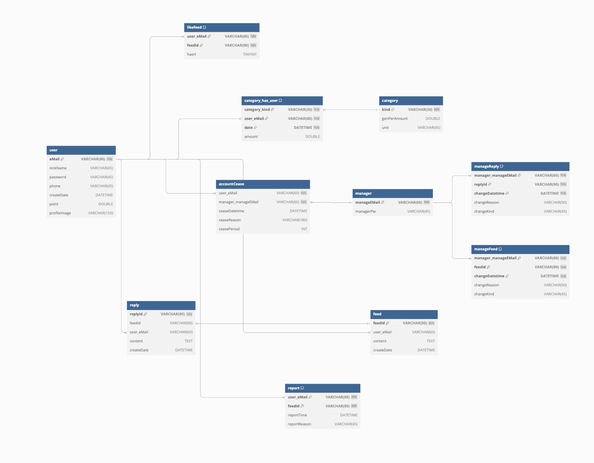
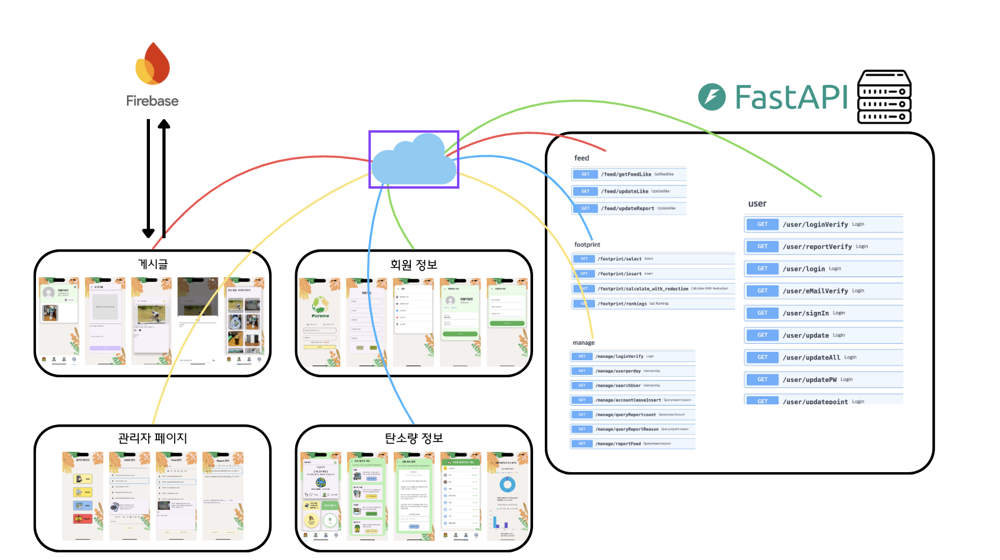

# 🌱 PUREME
> 생활 속 친환경 실천을 **기록 → 시각화 → 습관화**  
> 활동별 **탄소 절감량을 계산**하고, 실천 내역을 관리하는 모바일 앱
> 유저들간의 커뮤니티로 친환경 실천 **동기부여**

---

## 📽️ 데모 영상
> 실제 앱 사용 흐름이 궁금하다면 아래 링크를 클릭하세요  
[👉 유튜브 시연 영상 보러가기](https://www.youtube.com/watch?v=IeVbMGM8hB8)

---

## 🧩 프로젝트 개요
PUREME는 사용자가 일상에서 수행한 활동(대중교통 이용, 재활용 등)을 기록하면  
**활동 × 계수 × 반복 횟수** 기반의 알고리즘으로 **탄소 절감량을 계산**하고,  
마이페이지에서 **누적 실천/목표/프로필**을 한눈에 확인할 수 있게 돕는 앱입니다.

Flutter 프론트엔드와 FastAPI 백엔드, MySQL, Firebase 인증을 연동해  
**데이터 수집 → 계산 → 시각화**의 흐름을 직접 구성했습니다.

---

## 👨‍💻 맡은 역할 (주니어 프론트엔드 관점 강조)

| 분야 | 주요 내용 |
|---|---|
| **프론트엔드** | Figma로 사용자 플로우 설계, Flutter 화면/네비게이션, 폼 검증(UI 에러 메시지, 비활성화 버튼), 비동기 로딩/에러 상태 처리, 마이페이지 UI 전체 구현 |
| **백엔드 연동** | FastAPI와 REST 통신 구조 정리, 요청/응답 스키마 맞춤, 이미지 업로드/다운로드 연동 |
| **데이터/인증** | MySQL 스키마 협업, Firebase Auth로 로그인/세션 처리, 사용자별 데이터 분기 |
| **프로젝트 리딩** | 작업 이슈·PR 관리, 공통 컴포넌트/스타일 가이드 정리 |

---

## 🛠 기술 스택

**Frontend**  
 

**Backend**  
 

**DB & Auth**  
 

**Tools**  
  

---

## 🌟 주요 기능

| 기능 | 설명 |
|---|---|
| 📏 탄소 절감량 계산 | 활동 선택·양 입력 → 표준화된 알고리즘으로 절감량 산출 |
| 🗂 실천 기록 | 날짜·활동·사진(인증)과 함께 누적 관리, 항목별 필터 |
| 👤 마이페이지 | 누적 실천, 목표 진행률, 최근 활동 요약, 프로필 이미지 |
| 🔐 로그인 | Firebase Auth 기반 간편 인증/세션 유지 |

---

## 🗂 데이터 모델 (ERD)

---

## 📘 API
FastAPI로 계산/기록/조회 API를 제공합니다. (요청/응답 스키마는 프론트에서 검증)  
아래는 실제 운영에 사용된 엔드포인트 구조 예시입니다.

---

## 🧠 트러블슈팅 기록 (문제 → 원인 → 해결 → 성과)

### 1) 활동을 하지 않은 날짜까지 절감량에 포함되던 문제
- **문제**: 특정 날짜에만 활동을 입력했는데, 입력하지 않은 날짜에도 일 평균 교통 기준(13.02kg)이 절감량으로 더해짐.
- **원인**: 가입일부터 현재일까지의 전체 일수로 기대 배출량을 계산하면서 **비활동 날짜**가 포함됨.
- **해결**:
  - 실제 활동이 기록된 날짜 집합(`category_day_counts`)을 별도로 저장/조회.
  - 교통/육류는 **활동 기록이 존재한 날짜 수만** 곱하도록 계산식 수정.
  - 전기/가스는 **월 기준**으로 환산하되, 해당 월에 활동이 없으면 절감 계산을 **스킵**.
  - *(FE)* 입력/필터 UI에서 날짜 범위를 명확히 표시하고, 미기록 구간은 회색 처리.
- **성과**: 입력하지 않은 날짜의 절감량이 제외되어 **과대계산 제거**, 리포트 신뢰도 향상.

---

### 2) 에너지 절감량(L) 환산 오류
- **문제**: kg 단위 절감량을 L(리터)로 바꿀 때 잘못된 환산 계수로 오차 발생.
- **원인**: 가솔린 1L당 CO₂ 배출량 **약 2.31kg**을 반영하지 않고 단순 환산.
- **해결**:
  - 환산식 고정: `liters = total_carbon_reduction_kg / 2.31`
  - 결과는 **소수 첫째 자리 반올림**으로 표기, 단위 명시.
  - *(FE)* 결과 카드/차트에 단위 Tooltip 추가.
- **성과**: 예) 16.76kg → **약 7.3L**로 일관되게 계산. 사용자 이해도 개선.

---

### 3) 탄소 절감 데이터 API 디코딩 오류 (RangeError)
- **문제**: 서버 응답의 `result` 필드를 리스트처럼 접근하여 `RangeError` 발생.
- **원인**: `result`가 실제로는 문자열 `"OK"`인데 `result[0]`처럼 인덱싱.
- **해결**:
  - `result`는 **문자열 비교(`== "OK"`)** 로 처리.
  - `summary` 등 선택적 필드는 **널/존재 여부 검사** 추가.
  - *(FE)* 응답 모델을 **타입 안전(예: sealed/model)** 으로 정리, 실패 시 재시도/가이드 노출.
- **성과**: 디코딩/필드 접근 오류 제거, **탄소 정보 정상 출력** 및 예외 대응 강화.

---

## ✏️ 느낀 점
데이터를 **설계 → 수집 → 표준화 → 시각화**까지 연결해보며,  
프론트엔드가 **사용자 가치를 수치로 전달**하는 역할임을 체감했습니다.  
특히 입력 폼 UX, 오류 핸들링, 비동기 분기 설계가 사용자 만족도에 얼마나 직접적인지 배웠습니다.

---

## 🔗 GitHub
[🔗 PUREME Repository](https://github.com/donghun-ha/PUREME)
